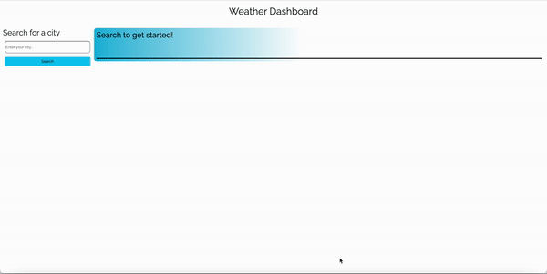

# weather-or-not

## Description

The Weather Or Not App is a user-friendly and informative weather forecasting application that provides up-to-date weather information for the next five days. This app aims to help users plan their week by offering accurate weather forecasts with an intuitive and visually appealing user interface. I was motivated by a need to practice API calling, on top of building something productive and useful, to build this application.

Looking to plan trip somewhere and need to know what kind of weather you'll be working with? Start here!

## Links

[Deployed App](https://miketritsch.github.io/weather-or-not/)

[GitHub Repo](https://github.com/MikeTritsch/weather-or-not)

## What comes next? and other issues...

This challenge tested my overall knowledge of everything I have learned up to this point. This is my first time working with a serverside API, and I learned how to read documentation as well as draw connections between the code and the API parameters.

I would have liked to see my forecast displayed in individual cards, rather than in a row based format. I am going to continue to work on planning out functions and consolidating my code. I have a lot of individual functions within my JavaScript file, and I'd like to work on chaining these or consolidating them in some way.

## Installation

N/A

## Usage

Upon the page loading, you will be met with a search input on the left side of the viewport.

To find the current day weather along with a five day forcast for a specified global location, simply enter the CITY NAME in the search input.

After clicking submit, your forecast and weather conditions will be presented to you.

For each unique city searched, a button will appear on the left side column containing the searched city's name.
These buttons serve as your search history and will stay bookmarked if you close or refresh the page.

Clicking these saved buttons will reload the weather conditions for that city.

## Credits

Big thanks to Meg Meyers and Jaytee Padilla for their help with guiding me through some of the complex parts of this challenge.

## License

MIT License

Copyright (c) 2023 Mike Tritsch

Permission is hereby granted, free of charge, to any person obtaining a copy
of this software and associated documentation files (the "Software"), to deal
in the Software without restriction, including without limitation the rights
to use, copy, modify, merge, publish, distribute, sublicense, and/or sell
copies of the Software, and to permit persons to whom the Software is
furnished to do so, subject to the following conditions:

The above copyright notice and this permission notice shall be included in all
copies or substantial portions of the Software.

THE SOFTWARE IS PROVIDED "AS IS", WITHOUT WARRANTY OF ANY KIND, EXPRESS OR
IMPLIED, INCLUDING BUT NOT LIMITED TO THE WARRANTIES OF MERCHANTABILITY,
FITNESS FOR A PARTICULAR PURPOSE AND NONINFRINGEMENT. IN NO EVENT SHALL THE
AUTHORS OR COPYRIGHT HOLDERS BE LIABLE FOR ANY CLAIM, DAMAGES OR OTHER
LIABILITY, WHETHER IN AN ACTION OF CONTRACT, TORT OR OTHERWISE, ARISING FROM,
OUT OF OR IN CONNECTION WITH THE SOFTWARE OR THE USE OR OTHER DEALINGS IN THE
SOFTWARE.

---